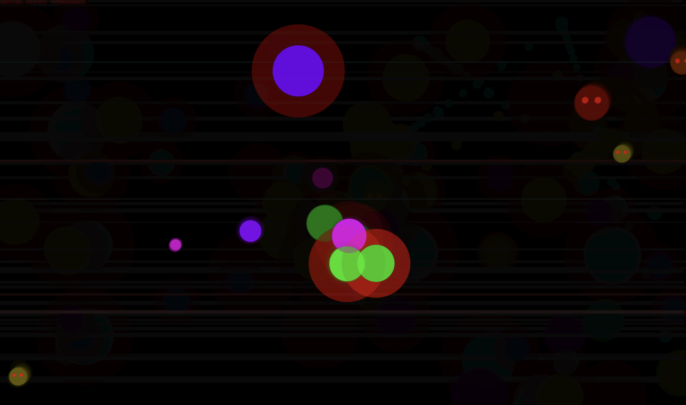
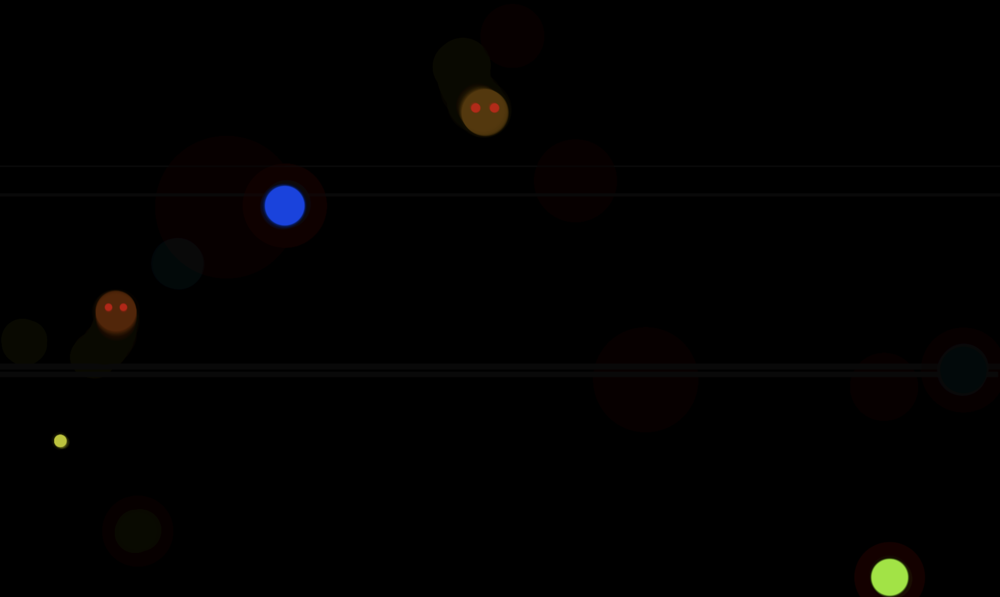
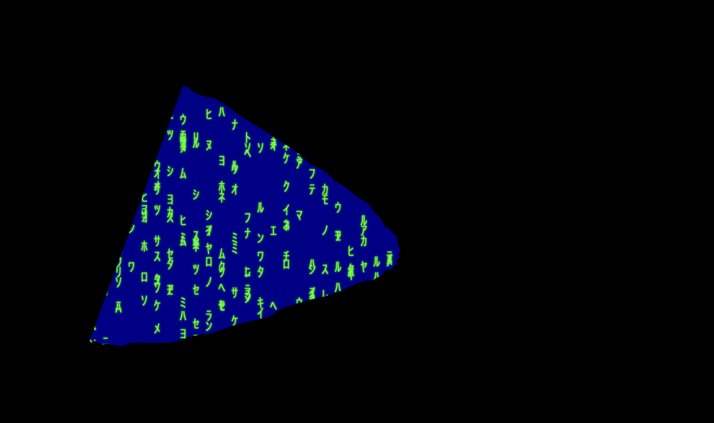

# Cool Arts with JS

Just made some graphic gestures using html canvas and mathematics formulas.

## 1st.html from: `((x ^ y) % (9 + Math.floor(Math.sin(time) * 3)))`

This animation features a grid of pulsating squares with shifting colors, creating a hypnotic wave-like effect.

## 2nd.html from: `((x ^ y) % (5 + Math.floor(wave)))`

This piece demonstrates a complex pattern of intersecting lines that morph and shift in response to mathematical functions.

## 3rd.html from: `(x + y + Math.floor(time * 4)) % 3;`

A dynamic color field that responds to circular motion, creating a swirling, kaleidoscope-like effect.

## 4th.html

An abstract fractal pattern that evolves over time, demonstrating recursive drawing techniques.

## 5th.html

A mesmerizing fractal tree that grows and rotates, showcasing advanced animation techniques.

## 6th.html

A mesmerizing fractal tree that grows and rotates, showcasing advanced animation techniques.

## 7th.html

A cool alien attack which change with mouse clicks and movements

## 8th.html

A cool alien attack which change with mouse clicks and movements, with blood splatter

## 9th.html

A cool alien attack which change with mouse clicks and movements, with jump scares

## 10th.html

Some circles doing some i don't know thing stuffs

## 11th.html

A thunder storm effect

## 12th.html

Matrix shits

Each HTML file can be opened in any modern web browser to view the live animations. The GIFs provide a preview of the visual effects implemented in each file.