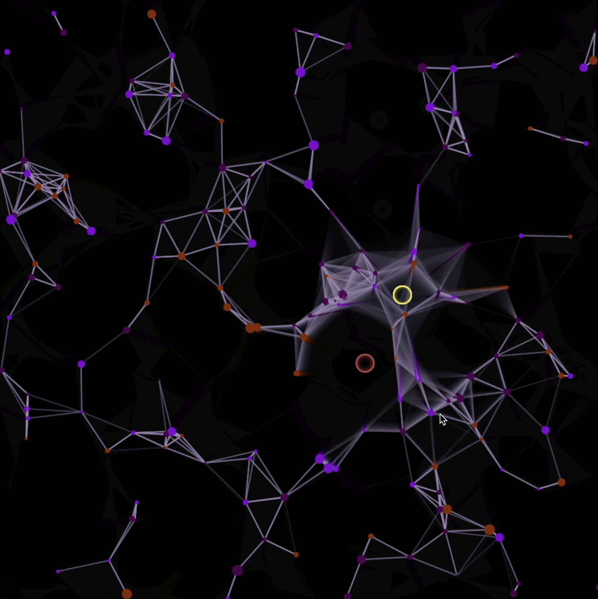
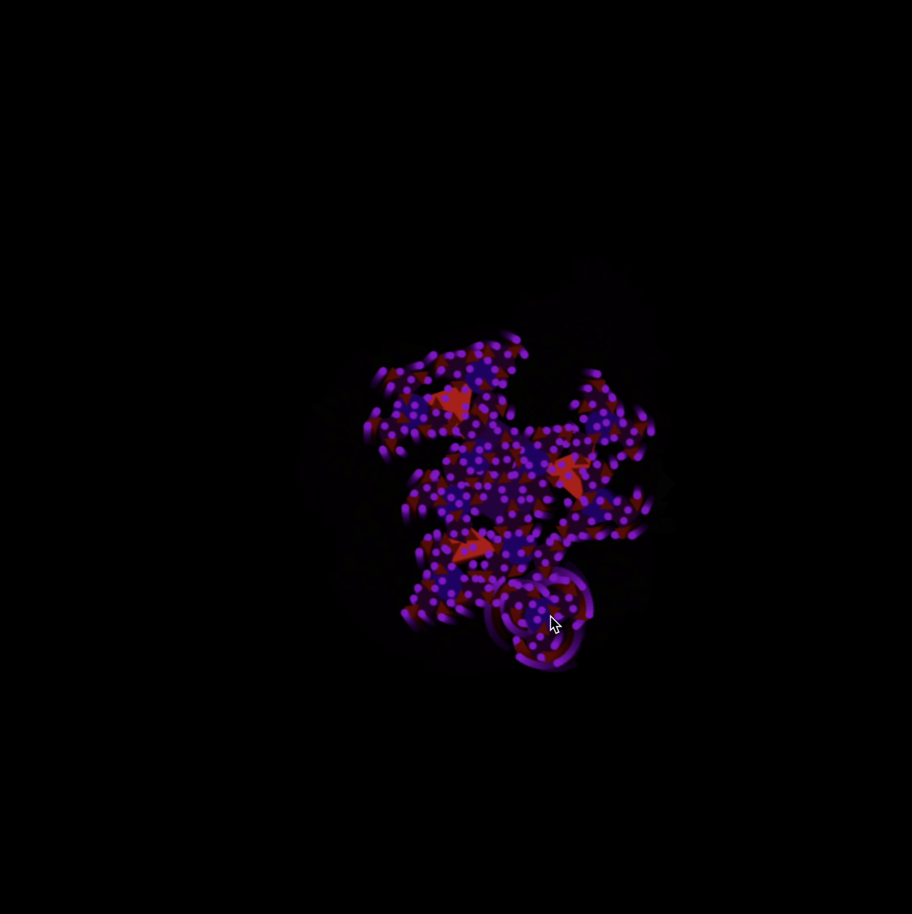
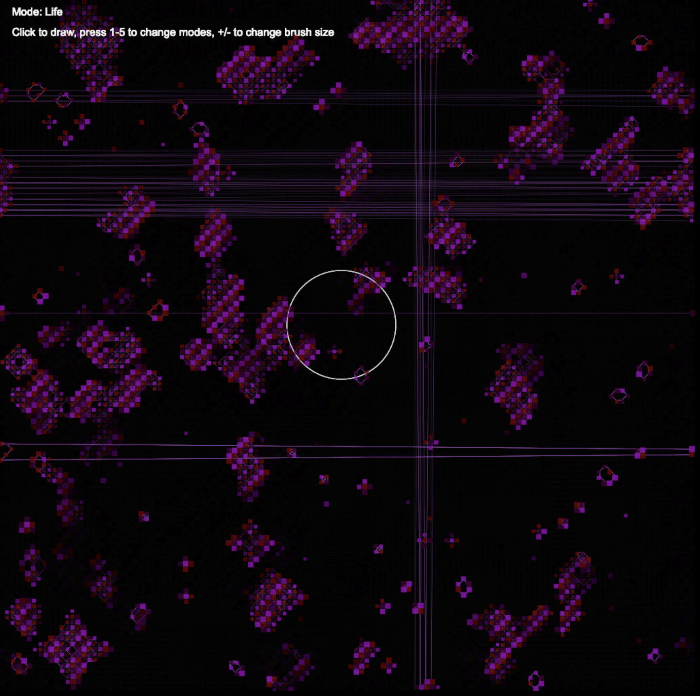
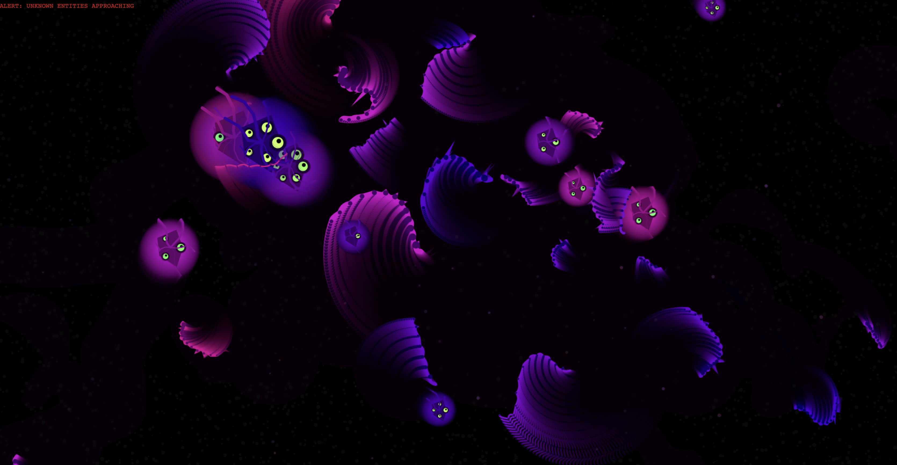
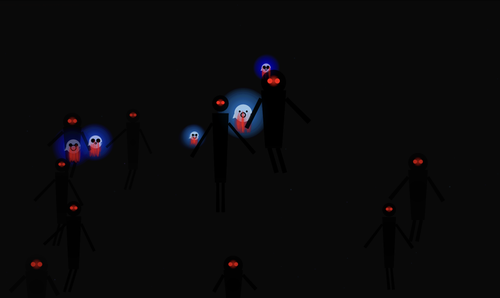

# Cool Arts with JS

This project contains a series of animated canvas art pieces created using JavaScript. Each HTML file showcases a unique visual effect, and corresponding GIFs are provided to demonstrate the animations.

## 1st.html

This animation features a grid of pulsating squares with shifting colors, creating a hypnotic wave-like effect.

## 2nd.html

This piece demonstrates a complex pattern of intersecting lines that morph and shift in response to mathematical functions.

## 3rd.html

A dynamic color field that responds to circular motion, creating a swirling, kaleidoscope-like effect.

## 4th.html

An abstract fractal pattern that evolves over time, demonstrating recursive drawing techniques.

## 5th.html

A mesmerizing fractal tree that grows and rotates, showcasing advanced animation techniques.

## 6th.html

A mesmerizing fractal tree that grows and rotates, showcasing advanced animation techniques.

## 7th.html

A cool alien attack which change with mouse clicks and movements

## 8th.html

A cool alien attack which change with mouse clicks and movements, with blood splatter

Each HTML file can be opened in any modern web browser to view the live animations. The GIFs provide a preview of the visual effects implemented in each file.